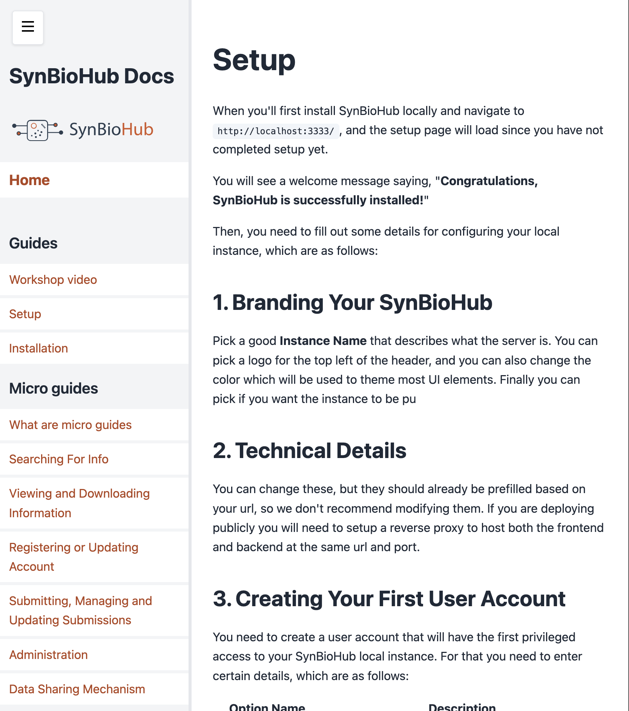

# SynBioHub2 Documentation Site

A simplified documentation site for SynBioHub2 that renders markdown content with client-side navigation.

## Project Structure

```
├── articles/              # Documentation content in markdown
│   ├── home.md           # Homepage content
│   ├── 1_guides/         # Getting started guides
│   ├── 2_micro guides/   # Specific how-to guides
│   ├── 3_advanced/       # Advanced topics
│   ├── 4_get involved/   # Community participation
│   └── 5_background/     # Background information
├── build-sidebar.js      # Builds the navigation structure
├── main.js              # Core application logic
├── styles.css           # Styling
├── theme.json          # Theme configuration
└── sidebar.json        # Generated navigation structure
```

## Adding or Modifying Content

The documentation content is organized in the `articles/` directory. Each subfolder represents a section, the name of the folder is directly parsed and converted to Title Case, with the number at the begining removed. The numeric prefix determines the display order.

### Article Properties

Articles can have frontmatter properties:
- `weight`: Controls the order within a section (lower numbers appear first)
- `hidden`: Set to true to exclude from navigation

### What The Site Looks Like
[It is currently live](https://synb-pages.peterhindes.com)

Or you can look at a screenshot below:



### File Organization

1. Article files should be placed in the appropriate numbered section folder
2. Section folders should be prefixed with numbers (e.g., `1_guides/`)
3. File names should use spaces instead of hyphens for better readability

### Building the Navigation

After adding, moving, or renaming article files, you must rebuild the sidebar:

```bash
node build-sidebar.js
```

This generates `sidebar.json` which defines the navigation structure.

## Development

The site uses vanilla JavaScript with no build process needed. Just serve the files with any static file server.

### Dependencies

The build process requires Node.js and the following package:
- `gray-matter`: For parsing markdown frontmatter

Install dependencies with:
```bash
npm install
```

### Core Files
- `main.js`: Handles routing, content loading, and UI interactions
- `styles.css`: Defines the layout and theme styles
- `theme.json`: Configures colors and visual properties
- `index.html`: Base HTML structure